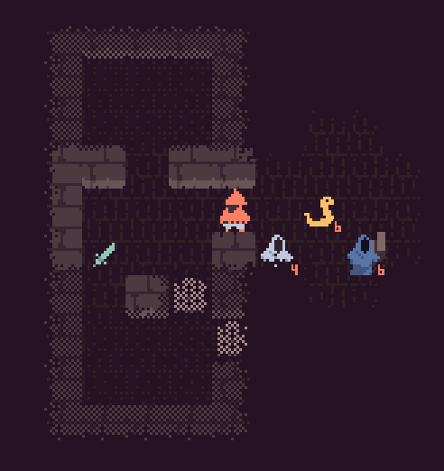

# Monk Tower

A small **mobile friendly** coffee-break roguelike game, written in Rust.

It is currently targeting:
+ WASM (with touch support)
+ Android
+ Windows
+ Linux

Releases can be found on [Itch.io](https://maciekglowka.itch.io/monk-tower)

[Soon on Google Play as well]

## Engine

Monk Tower is based on a custom-made 2d game framework:
[GitHub Repo](https://github.com/maciekglowka/rogalik)
